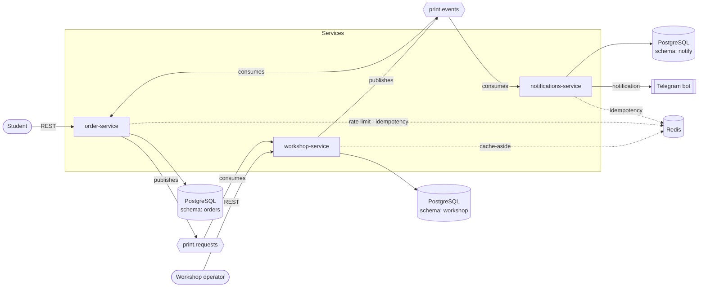
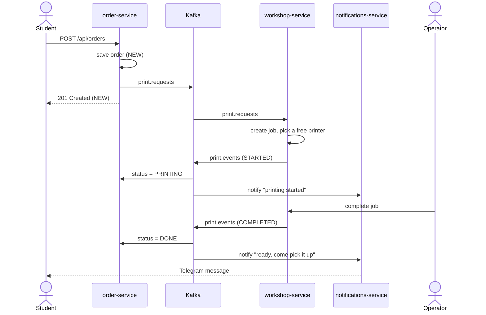

<div align="center">

# 🖨️ Print Lab

**An event-driven 3D-printing queue: submit a request for a figurine, get a Telegram notification when it's ready.**

Java 25 · Spring Boot · Apache Kafka · PostgreSQL · Redis · Telegram

</div>

---

> 🚧 **Work in progress.** The multi-module skeleton, infrastructure, database migrations, and Kafka/Redis configuration are in place. Business logic, REST endpoints, and the Telegram bot are not implemented yet. See [Project status](#-project-status).

## 📖 About

Print Lab is a small microservice system for managing a 3D-printing queue. A student submits a request to print a model on a 3D printer. The request is processed asynchronously, and as soon as there is a result, the student receives a notification in a Telegram bot.

The key idea: **`POST /api/orders` returns immediately** with status `NEW`. Printing and notifications happen in the background, and the services communicate **only through Kafka**.

### Design rules

- **One public API.** `order-service` is the only API students use. `workshop-service` exposes a REST API for the workshop operator only.
- **Kafka only between services.** No service ever calls another service over HTTP.
- **Database per service.** Each service owns its own PostgreSQL schema and never reads another service's tables.
- **Shared Redis, separate prefixes.** `order:`, `workshop:`, `notify:`.
- **At-least-once delivery, idempotent consumers.** Every consumer tolerates duplicate events.

---

## 🏗️ Architecture



### Services

| Service | Port | Responsibility |
|---|:---:|---|
| `order-service` | 8080 | Public REST API. Stores students and orders, publishes print requests, updates order status from workshop events |
| `workshop-service` | 8081 | Manages printers and the print queue, picks a free printer, publishes progress events. Operator REST API |
| `notifications-service` | 8082 | Consumes events and sends Telegram notifications. Kafka only, no business API |

### Kafka topics

| Topic | Producer | Consumers | Purpose |
|---|---|---|---|
| `print.requests` | order-service | workshop-service | A new print request |
| `print.events` | workshop-service | order-service, notifications-service | Progress of a print job (`STARTED`, `COMPLETED`, `FAILED`) |

Topic partitions and replication factor are configured in each service's `KafkaConfiguration`.

### The main flow



---

## 📨 Event Contract (draft)

All topics use one JSON format. **Agree on it before writing code and treat it as frozen.**

```json
{
  "eventId": "b3f1c2a0-5d7e-4c1a-9f3b-2e8a6d4c7b10",
  "eventType": "STARTED",
  "occurredAt": "2026-09-01T08:30:00Z",
  "orderId": 42,
  "studentId": 7,
  "studentEmail": "ivan@example.com",
  "material": "PLA",
  "printerId": 1,
  "reason": null
}
```

| Field | Description |
|---|---|
| `eventId` | New UUID for every event, never reused. This is the **deduplication key** |
| `eventType` | `STARTED`, `COMPLETED`, or `FAILED` on `print.events` |
| `occurredAt` | ISO-8601 timestamp (UTC) |
| `orderId`, `studentId` | Identifiers from order-service |
| `studentEmail` | Travels inside the event so notifications-service never has to ask anyone |
| `material` | `PLA`, `PETG`, or `ABS` |
| `printerId` | Filled only by workshop events |
| `reason` | Filled only for `FAILED` (e.g., "printer jammed") |

**Guarantees**

1. Producers never change the JSON structure without the agreement of all teams.
2. Consumers must tolerate duplicate deliveries of the same event.
3. Consumers must ignore event types they don't handle.

---

## 🧠 Business Rules

**Orders**
- `material` must be one of `PLA`, `PETG`, `ABS`; `modelName` must not be blank (max 255 characters); the student must exist.
- Status machine:

```text
NEW --> QUEUED --> PRINTING --> DONE
 |         |            \-----> FAILED
 +---------+--> CANCELED   (only from NEW or QUEUED)
```

- `NEW` → `QUEUED` is set by order-service once the request is handed over to Kafka. `PRINTING`, `DONE`, and `FAILED` are set only by order-service's own Kafka consumers, never over HTTP.
- Rate limit: **5 orders per hour per student**; the 6th returns `429`.
- Cancelling an order that is already printing returns `409`.

**Workshop**
- On a new request: create a job (`WAITING`), look for a `FREE` printer that supports the material, and if found mark it `BUSY`, move the job to `PRINTING`, and publish `STARTED`. Otherwise the job waits.
- When a printer is freed, the oldest waiting job for its material starts automatically.
- Only `PRINTING` jobs can be completed or failed; anything else returns `409`.
- Printers are seeded by a migration (e.g., two PLA printers and one PETG printer).

**Notifications**
- One message per event: accepted, printing started, ready to pick up, or failed (with the reason).
- All data for a message comes from the event itself. If a service needs to call another service for data, the event contract is wrong and should be fixed instead.

---

## 🔁 Reliability

### Idempotency

Kafka may deliver the same message more than once, so every consumer follows the same pattern:

```java
String key = "workshop:processed:" + event.eventId();
Boolean firstTime = redis.opsForValue().setIfAbsent(key, "1", Duration.ofHours(24));
if (Boolean.FALSE.equals(firstTime)) {
    return; // duplicate, skip
}
// ... actual processing
```

If `print.requests` is delivered twice, the second delivery hits the Redis key: no second job is created and no second notification is sent.

### Cache-aside

`workshop-service` caches the list of free printers per material (`workshop:printers:free:{material}`, TTL 60 s):

1. **Invalidate on write.** Whenever a printer changes status, the cache key is deleted (not updated) in the same code path.
2. **TTL as a safety net.** If the service crashes between the DB commit and the delete, the key expires and the cache heals itself.
3. **Stale cache is harmless.** The cache is only a hint; the final printer assignment is made against PostgreSQL inside a transaction.

### Producers and consumers

- Producers use `acks=all` with idempotence enabled and retries.
- Consumers use manual acknowledgement, `earliest` offset reset, and JSON (de)serialization.
- If a service is down, Kafka retains the messages and the consumer catches up on restart.

### Redis keys

| Key | Service | TTL | Purpose |
|---|---|---|---|
| `order:rate:{studentId}` | order | 1 h | Rate limit (5 orders/hour) |
| `order:processed:{eventId}` | order | 24 h | Event deduplication |
| `workshop:processed:{eventId}` | workshop | 24 h | Event deduplication |
| `workshop:printers:free:{material}` | workshop | 60 s | Cache of free printers |
| `notify:processed:{eventId}` | notifications | 24 h | Never notify twice |

---

## 🧱 Tech Stack

- **Language / platform:** Java 25, Spring Boot, Maven multi-module build
- **Messaging:** Apache Kafka (KRaft mode), Spring Kafka, JSON via Jackson
- **Data:** Spring Data JPA (Hibernate, `ddl-auto: validate`), PostgreSQL 16, **Liquibase** migrations
- **Cache & idempotency:** Redis 7, Spring Data Redis
- **Utilities:** MapStruct (unmapped target properties fail the build), Lombok
- **Notifications:** Telegram bot
- **Testing:** JUnit 5, Spring Boot Test, Testcontainers (PostgreSQL, Kafka)
- **Infrastructure:** Docker Compose, Kafka UI

---

## 🗂️ Repository Layout

```text
print-lab/
├── order-service/            # public REST API, orders, status tracking
├── workshop-service/         # printers, queue, operator API
├── notifications-service/    # event consumer, Telegram notifications
├── docker/
│   └── docker-compose.yaml   # Kafka, Kafka UI, PostgreSQL, Redis
├── LABPRINT-PROJECT.md       # full project specification
└── pom.xml                   # parent POM
```

Each service has the same internal layout: `config/` (Kafka, Redis), `constant/`, `exception/`, `dto/`, and Liquibase migrations in `src/main/resources/db/changelog/`.

---

## 🚀 Quick Start

### Prerequisites

- **JDK 25** and **Maven 3.9+** (or the bundled `./mvnw`); the build enforces this
- **Docker**

### 1. Start the infrastructure

```bash
docker compose -f docker/docker-compose.yaml up -d postgres redis kafka kafka-ui
```

| Component | Address | Notes |
|---|---|---|
| PostgreSQL | `localhost:5432` | database `print-lab`, user `myUser`, password `myPass` |
| Redis | `localhost:6379` | |
| Kafka | `localhost:9092` | KRaft mode, no ZooKeeper |
| Kafka UI | http://localhost:8089 | inspect topics and messages |

### 2. Set environment variables

```bash
export SPRING_DATASOURCE_USERNAME=myUser
export SPRING_DATASOURCE_PASSWORD=myPass

export STORE_JWT_SECRET='replace-with-a-random-string-of-at-least-32-chars'   # order-service

export GOOGLE_CLIENT_ID=...
export GOOGLE_CLIENT_SECRET=...
```

> The services still require the Google OAuth2 settings at startup, even though authentication is out of scope for v1.

### 3. Run the services

Each in its own terminal:

```bash
./mvnw -pl order-service spring-boot:run           # http://localhost:8080
./mvnw -pl workshop-service spring-boot:run        # http://localhost:8081
./mvnw -pl notifications-service spring-boot:run   # http://localhost:8082
```

Liquibase creates the `orders`, `workshop`, and `notify` schemas on first start.

---

## 🔌 API (planned)

### Student-facing — `order-service`

| Method | Path | Description |
|---|---|---|
| `POST` | `/api/students` | Register a student (`email`, `name`) |
| `POST` | `/api/orders` | Create a print request (`studentId`, `modelName`, `material`), returns `201` with status `NEW` |
| `GET` | `/api/orders/{id}` | Get an order with its current status |
| `GET` | `/api/orders?studentId=7` | List a student's orders |
| `POST` | `/api/orders/{id}/cancel` | Cancel (only from `NEW` or `QUEUED`, otherwise `409`) |

### Operator-only — `workshop-service`

Not for students; kept under the `/internal/**` prefix.

| Method | Path | Description |
|---|---|---|
| `GET` | `/internal/printers` | List printers and their status |
| `GET` | `/internal/jobs?status=PRINTING` | List jobs |
| `POST` | `/internal/jobs/{id}/complete` | Finish a job and publish `COMPLETED` |
| `POST` | `/internal/jobs/{id}/fail` | Fail a job with a `reason` and publish `FAILED` |

---

## 🗄️ Database

One PostgreSQL instance, three isolated schemas managed by Liquibase.

| Schema | Tables |
|---|---|
| `orders` | `students`, `print_orders` |
| `workshop` | `printers`, `jobs` (`order_id` is **not** a foreign key: it belongs to another service) |
| `notify` | `sent_notifications` (log of sent notifications, unique by `event_id`) |

---

## 📋 Project Status

| Area | Status |
|---|:---:|
| Maven multi-module build, enforced JDK/Maven versions | ✅ |
| Docker Compose: Kafka (KRaft), Kafka UI, PostgreSQL, Redis | ✅ |
| Liquibase migrations for all three schemas | ✅ |
| Kafka and Redis configuration in every service | ✅ |
| Global error handling (`AppException`, `AppErrorCode`) | ✅ |
| Kafka topics `print.requests` / `print.events` | ⬜ |
| Order REST API and status machine | ⬜ |
| Kafka producers and consumers | ⬜ |
| Workshop queue logic and operator API | ⬜ |
| Idempotency and cache-aside implementation | ⬜ |
| Telegram bot notifications | ⬜ |
| Unit and integration tests | ⬜ |
| Dockerfiles for the services | ⬜ |

---

## 🗺️ Roadmap

- [ ] Implement the Kafka contract and the order → workshop → notifications flow end to end
- [ ] Rate limiting (5 orders per hour) and event deduplication through Redis
- [ ] Order cancellation, including how the workshop drops a waiting job
- [ ] Telegram bot, including how a student is linked to a Telegram chat
- [ ] Meaningful tests per service (validation, status transitions, idempotency)
- [ ] Dockerfiles and running all services through Compose

**Out of scope for v1:** STL file upload, authentication, API gateway, service discovery, Kubernetes, saga and outbox patterns, schema registry.

---

<div align="center">

Built as an academy microservices project

</div>
